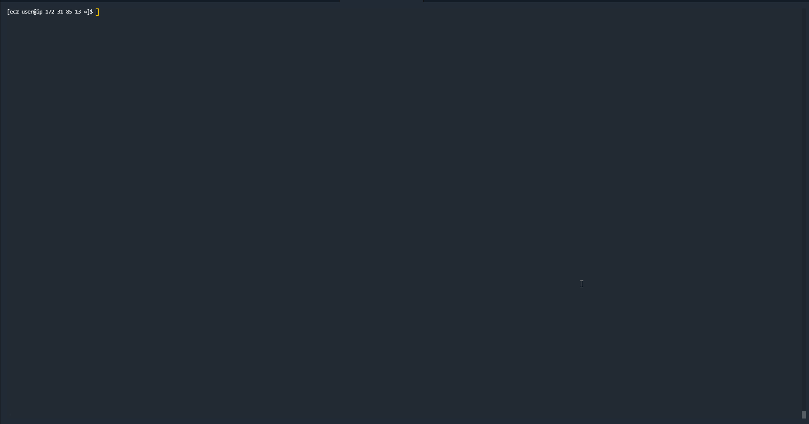

## EPIC FDA 

A tool to download and explore FDA datasets from https://api.fda.gov/download.json

This tool is divided in 2 main tools


## USAGE 

``` bash

go get github.com/jpramirez/epicFDA

cd $GOROOT/src/github.com/jpramirez/epicFDA/


make 

make build/fetcher-linux

make build/weblayer-linux

cd build/dist/linux/

bin/epicFDAFetcher-server.v1 --config config/config.json


```

documentation in progress 
### epicFDAFetcher (WIP)

Will fetch the entire dataset and store it in the destination folder 


### epicFDAFetcher-server.v1  (WIP)

Will Run an https api currently with the following Enpoints

/api/v1/liveness -> Healtz of the service
/api/v1/downloadIndex -> Download the main index and store it.

In progress

Activate download, unzip and get dataset data in json per Category.
Start Microserice extraction (basic Map Reduce in GO)
Integrate with possible Python3 backend.

Both binaries relay on config.json to define Webaddress, storage folder, log file and SSL certificates.

All files will be downloaded in config.datasetfolder destination order by Library / Type / Date / DisplayName 
It has a control (rudimentary) to pick up where it left (in case of failure) So we can download in parts.

It's not using any go routine at this moment so, in case more speed is needed we can maximize download speed.
No Sharding has been setup.

This is a basic implementation to download the entire dataset to play with.


## Github deployment

We use github.com/aktau/github-release to upload to the repository

```bash

go get github.com/aktau/github-release

```

For automatic deployment on github remeber to setup your  GITHUB_TOKEN="".

For a clean upload to distribution in github.

``` bash

make clean

make

make build/all

make package/linux

./uploadGithub.sh

```

This will zip files and make a distribution, Version is inside the bashfile to change to something else as needed. (Can also be taken from pkg/constants/version.go )

For demo on downloading on AWS

